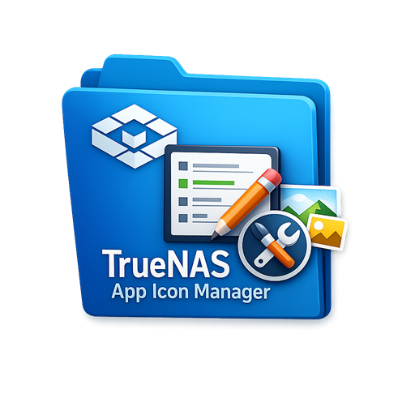
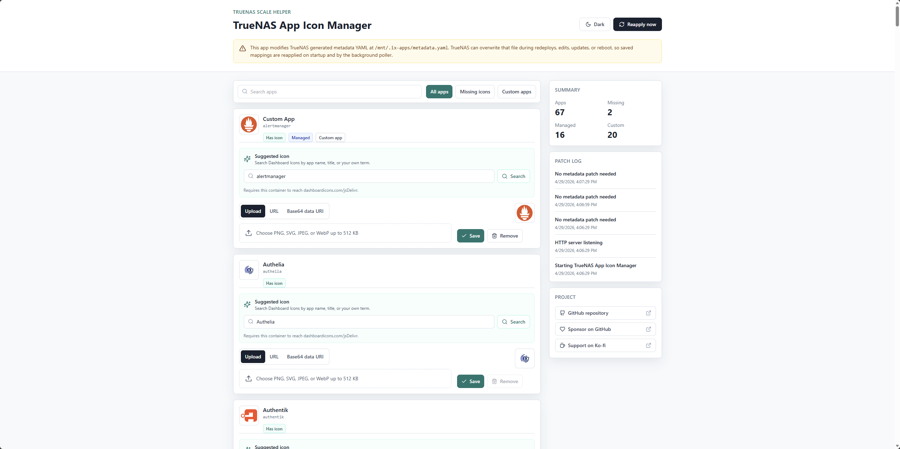
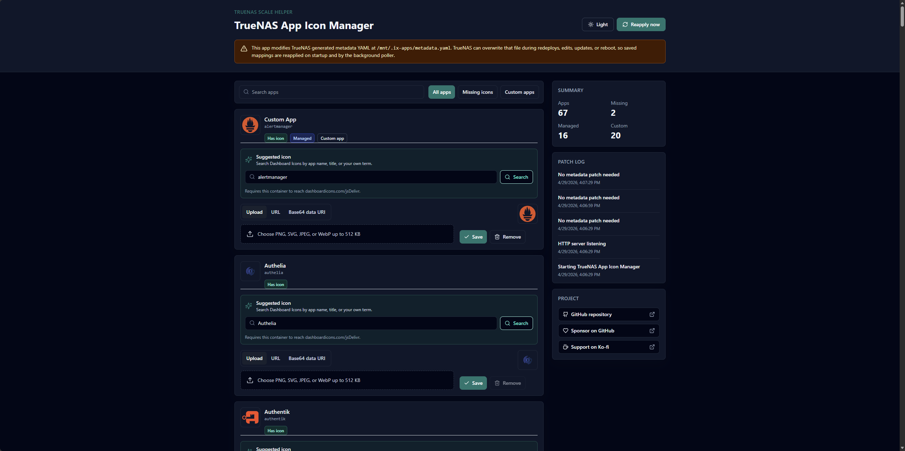
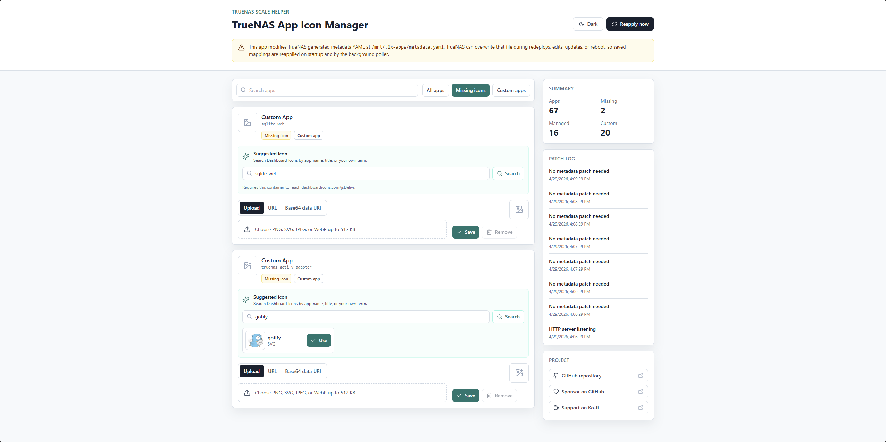
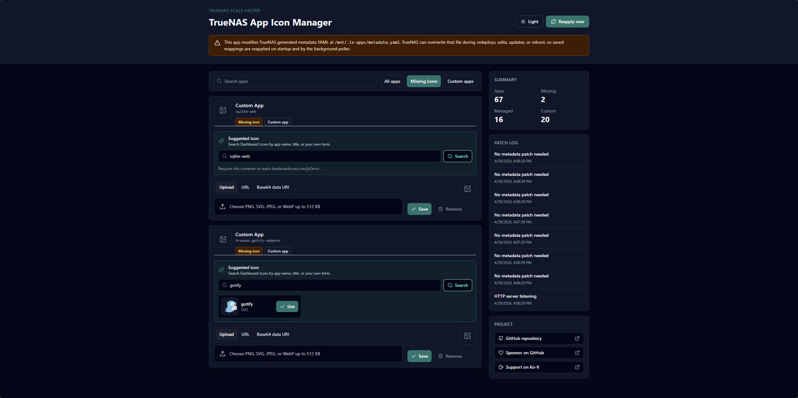

# TrueNAS App Icon Manager



**TrueNAS App Icon Manager** is a self-hosted web application for managing custom app icons in the **TrueNAS SCALE Apps UI**.

It is built for **TrueNAS SCALE 25.10.1** and the newer **Docker-based Apps** system. It helps users persist and reapply custom icons for TrueNAS custom apps by safely patching the generated Apps metadata YAML file.

Repository: [github.com/amnya/truenas-app-icon-manager](https://github.com/amnya/truenas-app-icon-manager)

This project is unofficial and community-maintained. It is not affiliated with or endorsed by iXsystems.

## Why This Exists

On TrueNAS SCALE Docker Apps, custom app metadata can exist at paths like:

```text
/mnt/.ix-apps/app_configs/<app-name>/metadata.yaml
```

However, adding an icon there does not always reliably propagate into the aggregated Apps UI metadata file:

```text
/mnt/.ix-apps/metadata.yaml
```

In practice, the TrueNAS Apps UI reads the app block in that generated metadata file. Adding this field makes the icon show in the UI:

```yaml
<app-name>:
  metadata:
    icon: "data:image/png;base64,..."
```

The problem is that `/mnt/.ix-apps/metadata.yaml` is generated by TrueNAS and can be overwritten during app edits, redeploys, updates, or reboots.

TrueNAS App Icon Manager solves that by storing your desired icon mappings separately in persistent app config, then reapplying them automatically whenever TrueNAS regenerates metadata.

## Features

- Web dashboard for TrueNAS SCALE app icons
- Lists apps from `/mnt/.ix-apps/metadata.yaml`
- Shows app name, title, `custom_app` status, current icon, missing icon status, and managed status
- Filters for all apps, missing icons only, and custom apps only
- Upload PNG, SVG, JPEG, or WebP icons
- Automatically converts uploaded icons to base64 data URIs
- Manually enter an icon URL
- Manually paste a base64 data URI
- Search and use suggested icons from [Dashboard Icons](https://dashboardicons.com/)
- Override Dashboard Icons search terms manually, for example search `Gotify` for an app named `igotify_custom`
- Stores mappings persistently in `/config/icon-mappings.json`
- Patches `<app-name>.metadata.icon` in TrueNAS generated metadata YAML
- Creates timestamped backups before every metadata write
- Reapplies saved icons on startup
- Polls metadata every 30 seconds and restores missing managed icons
- Includes a Reapply now button
- Includes light and dark mode
- Provides REST API endpoints for automation
- Dockerfile and TrueNAS custom app compose example included

## Screenshots

### Dashboard Overview





### Dashboard Icons Search





## Safety Warning

This application modifies TrueNAS generated metadata YAML:

```text
/mnt/.ix-apps/metadata.yaml
```

That file is managed by TrueNAS. TrueNAS may overwrite it during redeploys, app edits, app updates, or system reboot. This app is designed around that behavior: it keeps your desired icon mappings in `/config/icon-mappings.json` and reapplies them when needed.

The app:

- Does not modify Docker Compose files
- Does not modify `/mnt/.ix-apps/app_configs`
- Does not require privileged mode
- Requires `/mnt/.ix-apps` mounted read-write so it can patch `metadata.yaml`
- Creates backups before every metadata write
- Refuses to patch if YAML parsing fails

Use at your own risk. Keep backups and understand that this is working with generated TrueNAS metadata.

## Requirements

- TrueNAS SCALE 25.10.1
- Docker-based TrueNAS Apps
- Access to deploy a custom Docker Compose app
- Bind mount access to `/mnt/.ix-apps`
- A persistent config directory for this app

## Required Bind Mounts

Inside the container:

```text
/ix-apps -> /mnt/.ix-apps
/config  -> persistent config directory
```

Recommended TrueNAS host paths:

```text
/mnt/.ix-apps:/ix-apps
/mnt/AMNYA Pool/Applications/TrueNAS_App_Icon_Manager:/config
```

`/config` stores:

```text
/config/icon-mappings.json
/config/backups/
/config/icon-manager.log
```

## Configuration

Environment variables:

| Variable | Default | Description |
| --- | --- | --- |
| `IX_APPS_PATH` | `/ix-apps` | Mounted TrueNAS Apps root |
| `METADATA_FILE` | `/ix-apps/metadata.yaml` | Aggregated TrueNAS Apps metadata YAML |
| `CONFIG_DIR` | `/config` | Persistent config directory |
| `POLL_INTERVAL_SECONDS` | `30` | Background reapply interval |
| `MAX_ICON_SIZE_BYTES` | `524288` | Max uploaded/fetched icon size |
| `PORT` | `8080` | Internal HTTP port |

## Quick Install With Prebuilt Image

The easiest install path is to use the prebuilt GitHub Container Registry image:

```text
ghcr.io/amnya/truenas-app-icon-manager:latest
```

For a pinned release, use a version tag instead:

```text
ghcr.io/amnya/truenas-app-icon-manager:v1.0.0
```

Use the pinned tag when you want predictable upgrades. Use `latest` when you want the newest published release.

## TrueNAS Custom App Deployment

In the TrueNAS SCALE Apps UI:

1. Go to **Apps**.
2. Choose the option to create or install a custom app.
3. Use Docker Compose / custom YAML mode.
4. Paste the compose example below.
5. Adjust the `/config` host path to a persistent dataset on your system.
6. Keep `/mnt/.ix-apps:/ix-apps` mounted read-write.
7. Save and start the app.
8. Open `http://<truenas-host>:8099`.
9. After changing icons, hard refresh the TrueNAS Apps UI.

Example compose YAML:

```yaml
services:
  truenas-app-icon-manager:
    image: ghcr.io/amnya/truenas-app-icon-manager:latest
    container_name: truenas-app-icon-manager
    restart: unless-stopped
    ports:
      - "8099:8080"
    environment:
      IX_APPS_PATH: /ix-apps
      METADATA_FILE: /ix-apps/metadata.yaml
      CONFIG_DIR: /config
      POLL_INTERVAL_SECONDS: "30"
      MAX_ICON_SIZE_BYTES: "524288"
    volumes:
      - /mnt/.ix-apps:/ix-apps
      - /mnt/AMNYA Pool/Applications/TrueNAS_App_Icon_Manager:/config
```

Then open:

```text
http://<truenas-host>:8099
```

### Notes For The `/config` Path

The `/config` mount should point to a dataset or directory that survives app recreation. It stores:

```text
/config/icon-mappings.json
/config/backups/
/config/icon-manager.log
```

Replace this example path with your own persistent path if needed:

```text
/mnt/AMNYA Pool/Applications/TrueNAS_App_Icon_Manager:/config
```

## Build From Source

On your TrueNAS host or another Docker machine:

```bash
docker build -t truenas-app-icon-manager:latest .
```

If you previously built an older copy and Docker appears to reuse stale layers, rebuild without cache:

```bash
docker build --no-cache -t truenas-app-icon-manager:latest .
```

Then use the locally built image in your compose YAML:

```yaml
services:
  truenas-app-icon-manager:
    image: truenas-app-icon-manager:latest
    container_name: truenas-app-icon-manager
    restart: unless-stopped
    ports:
      - "8099:8080"
    environment:
      IX_APPS_PATH: /ix-apps
      METADATA_FILE: /ix-apps/metadata.yaml
      CONFIG_DIR: /config
      POLL_INTERVAL_SECONDS: "30"
      MAX_ICON_SIZE_BYTES: "524288"
    volumes:
      - /mnt/.ix-apps:/ix-apps
      - /mnt/AMNYA Pool/Applications/TrueNAS_App_Icon_Manager:/config
```

For local development without Docker:

```bash
npm install
npm run dev
```

Frontend dev server:

```text
http://localhost:5173
```

Backend API:

```text
http://localhost:8080
```

For local testing, point `METADATA_FILE` and `CONFIG_DIR` at temporary directories so you do not touch a real TrueNAS metadata file.

## Docker Build Troubleshooting

If a manual Docker build fails during dependency installation, first make sure you are building from the latest source and that the Dockerfile contains `RUN npm install` in the build stage and `RUN npm install --omit=dev` in the runtime stage.

If the error mentions stale packages, lockfile sync, or a previous failed build, clear Docker's build cache for this image by using:

```bash
docker build --no-cache -t truenas-app-icon-manager:latest .
```

Most users do not need to build the image manually after public releases. Use the prebuilt GHCR image instead:

```text
ghcr.io/amnya/truenas-app-icon-manager:latest
```

## How To Use

1. Open the web UI.
2. Find the app you want to customize.
3. Upload an icon, paste a data URI, enter an icon URL, or search Dashboard Icons.
4. Preview the icon.
5. Click Save or Use.
6. The app stores the desired mapping in `/config/icon-mappings.json`.
7. The app patches `/mnt/.ix-apps/metadata.yaml` under `<app-name>.metadata.icon`.
8. Hard refresh the TrueNAS Apps UI.

If TrueNAS regenerates metadata and removes the icon, this app should restore it within the configured polling interval.

## Dashboard Icons Search

The app can search [Dashboard Icons](https://dashboardicons.com/) for likely app icons.

The search box starts with the TrueNAS app title or app name, but you can replace it with anything. Example:

- TrueNAS app name: `igotify_custom`
- Manual icon search term: `Gotify`
- Suggested icon result: `gotify.svg`

When you click Use, the backend downloads the icon from the Dashboard Icons CDN, validates it, converts it to a base64 data URI, stores it in `/config/icon-mappings.json`, and injects that exact data URI into TrueNAS metadata.

This feature requires outbound HTTPS access from the container to Dashboard Icons / jsDelivr.

## Icon Storage Format

Uploaded and accepted suggested icons are stored as base64 data URIs:

```text
data:image/png;base64,iVBORw0KGgo...
```

The stored value is injected exactly into:

```text
<app-name>.metadata.icon
```

Local filesystem paths are not used as the primary icon source.

## REST API

- `GET /api/apps`
- `GET /api/mappings`
- `GET /api/icon-suggestions/:appName?title=<title>&query=<search>`
- `POST /api/icon-suggestions/:appName/use`
- `POST /api/mappings/:appName`
- `DELETE /api/mappings/:appName`
- `POST /api/reapply`
- `GET /api/logs`
- `GET /api/status`
- `GET /api/health`

### Upload An Icon

```bash
curl -F "iconFile=@favicon.png" http://<truenas-host>:8099/api/mappings/alphaedge
```

### Search Dashboard Icons

```bash
curl "http://<truenas-host>:8099/api/icon-suggestions/igotify_custom?query=Gotify"
```

### Use A Suggested Icon

```bash
curl -X POST http://<truenas-host>:8099/api/icon-suggestions/igotify_custom/use \
  -H "Content-Type: application/json" \
  -d '{"url":"https://cdn.jsdelivr.net/gh/homarr-labs/dashboard-icons/svg/gotify.svg","slug":"gotify"}'
```

### Save An Icon URL

```bash
curl -F "iconUrl=https://example.com/icon.png" http://<truenas-host>:8099/api/mappings/alphaedge
```

### Save A Base64 Data URI

```bash
curl -F "icon=data:image/png;base64,iVBORw0KGgo..." http://<truenas-host>:8099/api/mappings/alphaedge
```

## Validation And Safety

Uploaded and fetched icons are validated before storage:

- Maximum size: 512 KB by default
- Allowed MIME types:
  - `image/png`
  - `image/svg+xml`
  - `image/jpeg`
  - `image/webp`
- SVG files are rejected if they contain scripts, inline event handlers, `javascript:` URLs, `data:text/html`, or `foreignObject`

Metadata patching is designed to be conservative:

- Parse YAML before patching
- Never patch if YAML parsing fails
- Preserve unrelated metadata fields
- Create a timestamped backup before every write
- Write to a temporary file first
- Validate generated YAML before replacing the original file
- Multiple reapply runs do not duplicate icon keys
- Saved mappings are retained even if an app temporarily disappears from metadata

## Release Tags And Docker Publishing

This repository includes GitHub Actions workflows for:

- CI on `main` pushes and pull requests
- Docker image publishing to GitHub Container Registry when a tag like `v1.0.0` is pushed

Release checklist:

1. Make sure `package.json` and `CHANGELOG.md` show the release version.
2. Commit all release changes.
3. Create a version tag:

```bash
git tag v1.0.0
```

4. Push the tag:

```bash
git push origin v1.0.0
```

5. Watch the **Publish Docker Image** workflow in GitHub Actions.
6. Confirm the image appears at:

```text
ghcr.io/amnya/truenas-app-icon-manager:v1.0.0
ghcr.io/amnya/truenas-app-icon-manager:latest
```

If the GHCR package is private after the first publish, open the package settings on GitHub and make it public.

## Testing

Run the backend tests:

```bash
npm test
```

Build the production frontend:

```bash
npm run build
```

## Project Structure

```text
client/                 React + Vite dashboard
server/                 Express API, YAML patcher, icon validation
public/favicon.png      App favicon and usable TrueNAS app icon
examples/               Docker Compose examples
samples/                Sample icon-mappings.json
tests/                  Node test runner tests
Dockerfile              Production container build
CHANGELOG.md            Release history
```

## Roadmap Ideas

Community contributions are welcome. Possible future features:

- One-click backup restore
- Optional patching of per-app `app_configs/<app-name>/metadata.yaml`
- Bulk icon matching from Dashboard Icons
- Better fuzzy matching and aliases
- Export/import mappings
- Multi-user authentication or reverse-proxy auth examples
- Official TrueNAS custom app packaging
- Helm/catalog support if TrueNAS changes app packaging again

## Support The Project

TrueNAS App Icon Manager is free and open source under the MIT License.

If this project helped you clean up your TrueNAS Apps UI, you can optionally support development:

- [Sponsor on GitHub](https://github.com/sponsors/amnya)
- [Support on Ko-fi](https://ko-fi.com/amnya)

Support is optional and never required to use the app.
## Contributing

Forks, issues, bug reports, and pull requests are welcome.

Good contribution areas:

- Testing on more TrueNAS SCALE versions
- Improving icon matching
- Improving Docker/TrueNAS deployment docs
- Adding screenshots
- Hardening metadata patch behavior
- Adding translations
- Improving accessibility

Please keep changes conservative around metadata writes. This app touches generated TrueNAS metadata, so reliability and safety matter more than cleverness.

## Could This Become A TrueNAS Apps Catalog App?

Possibly. The current project is designed to work as a TrueNAS custom app today. For inclusion in an official or community TrueNAS Apps catalog, it would likely need additional packaging, review, documentation, versioning, support expectations, and community testing.

If the TrueNAS community finds it useful, the project can evolve in that direction. Contributions and real-world testing reports would help a lot.

## License

This project is licensed under the MIT License. See [LICENSE](LICENSE).

MIT is intentionally permissive: people can use, fork, modify, redistribute, and build on this app while keeping the copyright and license notice intact.

## Keywords

TrueNAS SCALE, TrueNAS Apps, TrueNAS custom app icons, TrueNAS metadata.yaml, Docker Apps, self-hosted, app icon manager, Dashboard Icons, custom app icon, TrueNAS community app.
